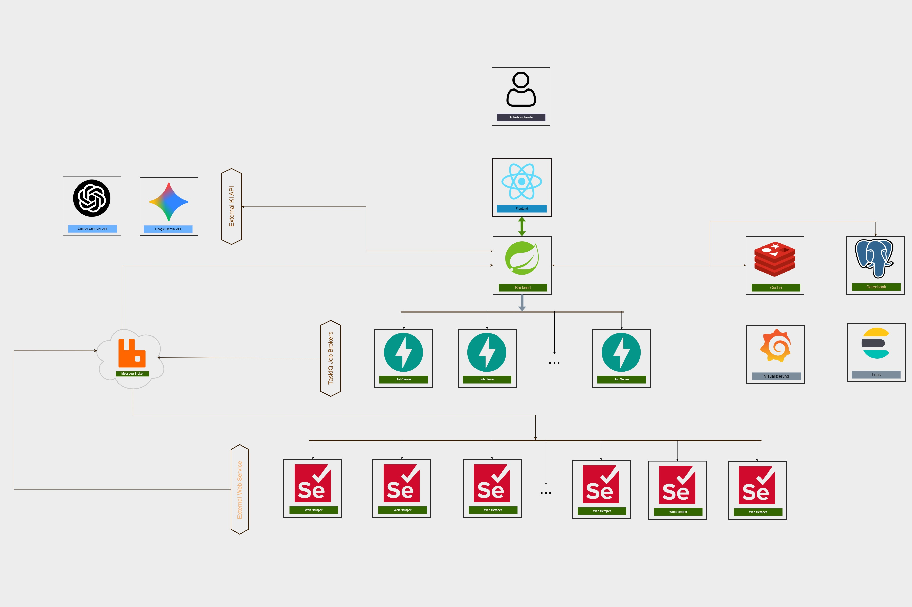

# DIGITALES JOB BERATER

### Überblick

JobPilot ist eine Full-Stack-Plattform zur automatisierten Aggregation, Analyse und Visualisierung von Stellenanzeigen.

Das System sammelt Stellenangebote aus verschiedenen Quellen, verarbeitet Jobanforderungen und Unternehmensinformationen und unterstützt Arbeitssuchende durch datenbasierte Einblicke in den Arbeitsmarkt. Durch eine skalierbare, ereignisgesteuerte Architektur können große Datenmengen effizient verarbeitet und analysiert werden.

### PROBLEMSTELLUNG

Immer wieder hört man in Deutschland, dass die Lage am Arbeitsmarkt angespannt ist. Außerdem weist der Arbeitsmarkt aufgrund von Entstehen neuen Technologien höhe Dynamik auf. Folglich steigt der Bedarf nach Spezialisten, die den Arbeitsmarks analyzieren und Beratung in Jobsuche anbieten.

Das Ziel des Projektes, ein digitales Partner der Arbeitsuchenden zu werden und die Jobsuche leicht zu machen, indem es:

- Stellenausschreibungen von mehreren Platformen analysiert
- Information über Arbeitgeber zur Verfügung stellt
- Die Jobanforderungen verarbeitet und eine Analyze darüber bietet
- Filtert alle Jobs, die nicht zum Bewerberprofil passen
- Lässt die Dynamik auf dem Arbeitsmarkt visuell verfolgen

### ARCHITEKTUR

### Hauptfunktionen

- Aggregation von Stellenanzeigen aus mehreren Quellen
- Automatisierte Datenerfassung mittels Python-basierter Web-Scraper
- Analyse von Stellenanforderungen und Unternehmensinformationen
- Filterung von Stellenangeboten anhand individueller Suchkriterien
- Visualisierung von Arbeitsmarkttrends und Stellenanforderungen
- Asynchrone Verarbeitung großer Datenmengen
- Skalierbare Microservice-Architektur

### TECH-STACK

<b>FRONTEND</b> 

- React
- TypeScript

<b>BACKEND</b> 

- Java
- Spring Boot

<b>DATENERFASSUNG</b> 

- Python

<b>MESSAGING</b> 

- RabbitMQ

<b>DATEN</b> 

- PostgreSQL
- Redis

<b>INFRASTRUKTUR</b> 

- Docker
- Docker Compose
- Kubernetes

#### LINK ZUM CODE

https://github.com/PavelKuzia/jobpilot 
<i>private repo - für Zugriff bitte um Anfrage</i>
